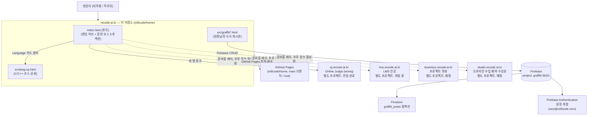

# ARCHITECTURE.md — 서비스 아키텍처

이 문서는 "Recode Coding" 서비스 전체(이 저장소 + 외부 연동 서브도메인)의 아키텍처를 정리한다. 구조가 바뀔 때마다(신규 서브도메인 오픈, 백엔드 교체, 배포 방식 변경 등) 이 문서를 함께 갱신한다. 특정 시점의 상세 작업 근거는 `../report/*.md`, 요구사항 변화는 `PRD.md`/`DEV_PLAN.md`(같은 `doc/` 폴더)를 참고.

- 최종 갱신: 2026-08-22 (`src/mockup.html` 내용을 `index.html`로 흡수, `mockup.html` 삭제)

## 1. 한눈에 보기

`recode.ai.kr`은 단일 서비스가 아니라, 메인 사이트(이 저장소) + 서로 독립적으로 개발되는 4개 서브도메인 프로젝트로 구성된 느슨한 연합 구조다. 메인 사이트는 빌드 도구 없는 정적 사이트이고, 유일한 동적 기능("원장님의 낙서" 게시판)만 Firebase를 서버리스 백엔드로 사용한다.

## 2. 배포 아키텍처

- **저장소**: `git@github.com:re8code/home.git` (`main` = 실서비스 배포 브랜치, `dev` = 작업 브랜치)
- **호스팅**: GitHub Pages, `main` 브랜치 `/ (root)` 소스(branch 배포는 `/ (root)` 또는 `/docs`만 지원, 임의 폴더 불가). `index.html`만 저장소 루트에 있어 별도 빌드 없이 그대로 서빙되고, 나머지 페이지는 `src/`에 모아뒀다(2026-08-22).
- **커스텀 도메인**: 저장소 루트 `CNAME` 파일에 `recode.ai.kr` 기재 → GitHub Pages가 이 값으로 서빙. DNS/HTTPS 설정 절차는 `../report/2026-07-29-deployment-guide.md` 참고(문서 작성 당시 예시 도메인은 dothome이었으나 현재 실제 연결 도메인은 `recode.ai.kr`).
- **브랜치 전략**: `dev`에서 작업 → 로컬 서버(`python3 -m http.server 8765`)로 검증 → `main`으로 merge하는 시점이 곧 실배포. **`index.html` 리뉴얼이 진행 중인 동안은 `main` merge를 보류**하고 `dev`에만 커밋을 쌓는다(2026-08-21 확정). `index.html` 콘텐츠 자체는 2026-08-22 완료됐지만, `main` 병합은 사용자가 별도로 지시할 때 진행한다.
- **빌드 파이프라인 없음**: 페이지 수(5~7개) 대비 빌드 도구 도입은 과하다고 판단해 순수 정적 HTML + Tailwind CDN + Vanilla JS ES Module 구조를 유지하기로 결정(`DEV_PLAN.md` §1).

## 3. 프론트엔드 구조 (이 저장소)

공유 컴포넌트나 템플릿 시스템이 없다 — 각 `.html`이 완전히 독립된 페이지이며, Tailwind 설정(`brand` 컬러, Pretendard 폰트 등)이 페이지마다 `` 블록으로 중복 정의되어 있다. `index.html`만 저장소 루트, 나머지는 전부 `src/`(GitHub Pages branch 배포가 `/root` 또는 `/docs`만 지원하기 때문 — §2 참고).

| 페이지 | 역할 | 비고 |
| --- | --- | --- |
| `index.html` (루트) | 랜딩 / 5갈래 내비게이션 허브 + 훈련 코스 5개 섹션(Language/Algorithm/Web & WebApp/Unity/Agent AI) + 핵심 철학 + CTA | OJ/낙서장/LMS/business/studio 진입점 + 1:1 상담 CTA(Google Forms 직결). Epic Games Store 레이아웃 참고 시안(`src/mockup.html`)을 2026-08-22 최종안으로 채택해 전면 교체, `mockup.html`은 삭제. Swiper·AOS를 CDN으로 추가 로드하는 유일한 페이지. `src/` 페이지로는 `src/` 접두사로 링크 |
| `src/graffiti.html` / `src/graffiti-detail.html` / `src/graffiti-new.html` | "원장님의 낙서" 게시판 (목록/상세·수정·삭제/작성) | 유일하게 Firebase와 통신하는 페이지군. 헤더는 GNB로 통일됐지만 본문 디자인 톤 조정(`doc/DEV_PLAN.md` Phase 2)은 아직 미착수 |
| `src/lang-cp.html` (외 `lang-*.html` 예정) | Language 코스 언어별 상세 페이지 | `index.html` Language 카드에서 연결되는 실제 페이지. 커리큘럼 목록 UI는 korea-pass.kr 공지사항 목록 페이지를 벤치마크. 현재 C/C++만 제작, 나머지 언어는 동일 패턴으로 순차 제작 예정 |

- **GNB**: `index.html`/`src/graffiti*.html`/`src/lang-cp.html` 5개 페이지 전부 헤더(`<header>` 전체 — 로고/nav/CTA/모바일 메뉴)가 동일한 마크업(페이지별 커스텀 nav 링크 없음, 2026-08-22 통일). 상세: `../CLAUDE.md` "페이지 구조".
- `src/` 안의 페이지끼리는 파일명만으로 상호 링크하고, 루트(`index.html`)나 `assets/`를 가리킬 때는 `../`를 붙인다.
- `assets/js/mobile-menu.js` — 모든 페이지 하단에서 `defer` 로드, 모바일 내비게이션 토글 공통 처리.
- `assets/image/` — 외부에서 가져온 로고·아이콘 리소스(예: `index.html` Language 카드의 언어별 로고 PNG). 출처/라이선스는 도입 시점 `../report/*.md`에 기록.

## 4. 데이터/백엔드 계층 — Firebase ("원장님의 낙서" 전용)

메인 사이트에서 유일하게 동적인 기능. 설정은 `assets/js/`에 역할별로 분리되어 있다.

- **프로젝트**: Firebase 프로젝트 `graffiti-3b1fc` (설정값은 `assets/js/firebase-config.js`).
- **DB**: Firestore, 컬렉션 `graffiti_posts` 1개. 목록/상세 조회(`read`)는 누구나 가능, 등록/수정/삭제(`write`)는 Firebase Authentication으로 로그인한 원장 계정(`won@re8code.com`)만 가능 — 규칙은 `firestore.rules`에 정의(Firebase 콘솔에 수동 게시 필요, 코드에서 자동 배포되지 않음).
- **인증**: Firebase Authentication (이메일/비밀번호), `assets/js/firebase-auth.js`가 로그인/로그아웃 처리. `assets/js/admin-auth.js`가 "수정/삭제/글 작성" 진입 시 비밀번호 모달(`requestAdminPassword`)과 삭제 확인 모달을 담당.
- **로컬 개발 폴백**: `firebase-config.js`의 `IS_PLACEHOLDER_CONFIG` 플래그(`projectId`가 `TEMP_`로 시작하면 true)로, 실제 Firebase 프로젝트 없이도 하드코딩 비밀번호(`DEV_FALLBACK_PASSWORD`) 기반 로컬 개발 모드가 동작한다. 이 플래그 하나로 다른 모든 Firebase 관련 파일이 분기하므로, 폴백 로직이 파일마다 중복 구현되지 않는다.
- **안정성 처리**: `assets/js/firebase-client.js`는 요청에 6초 타임아웃(`REQUEST_TIMEOUT_MS`)을 두고, 초과 시 연결을 `terminate` 후 리셋해 무한 재시도를 방지한다.
- **App 인스턴스**: `assets/js/firebase-app.js`의 `getFirebaseApp()` 싱글턴을 Firestore/Auth가 공유한다.

## 5. 외부 서비스 생태계 (서브도메인)

`recode.ai.kr` 하위 4개 서브도메인은 각각 **별도 프로젝트로 독립 개발**되며, 이 저장소는 그 링크만 연결한다(코드/배포를 이 저장소에서 관리하지 않음).

| 서브도메인 | 용도 | 상태 (2026-08-22 기준) |
| --- | --- | --- |
| `oj.recode.ai.kr` (wonoj) | Online Judge | 개발 완료, `index.html` 헤더에 실제 링크 연결됨(새 탭) |
| `lms.recode.ai.kr` | LMS 인강 | 별도 프로젝트로 개발 중, 헤더에 "준비중" 배지 + 비활성 링크 |
| `business.recode.ai.kr` | 프로젝트 의뢰 | 별도 프로젝트 예정, "준비중" 배지 + 비활성 링크 |
| `studio.recode.ai.kr` | 오프라인 수업 예약·수강권 관리 | 별도 프로젝트 예정, "준비중" 배지 + 비활성 링크 |

서브도메인이 실제로 오픈되면 이 저장소에서 할 일은 "준비중" 배지 제거 + 실제 링크로 교체뿐이다(`PRD.md` §8 미결 사항 참고).

## 6. 이 문서의 갱신 원칙

- 아키텍처에 영향을 주는 변경(신규 서브도메인 오픈, 백엔드 서비스 추가/교체, 배포 방식 변경, 브랜치 전략 변경 등)이 생기면 이 문서를 함께 갱신하고 "최종 갱신" 날짜를 업데이트한다.
- 특정 시점의 세부 작업 과정은 이 문서가 아니라 `../report/YYYY-MM-DD-*.md`에 남긴다 — 이 문서는 "현재 구조의 스냅샷"만 유지하고, 과거 변경 이력 서술은 최소화한다.
- 요구사항·범위 자체가 바뀌면 `PRD.md`/`DEV_PLAN.md`를 먼저 갱신하고, 그 결과로 실제 구조가 바뀐 뒤 이 문서에 반영한다.
