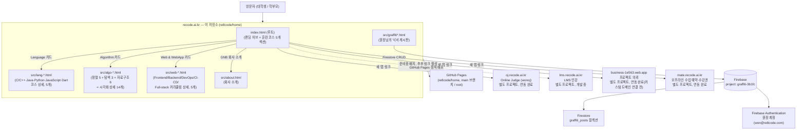

# ARCHITECTURE.md — 서비스 아키텍처

이 문서는 "Recode Coding" 서비스 전체(이 저장소 + 외부 연동 서브도메인)의 아키텍처를 정리한다. 구조가 바뀔 때마다(신규 서브도메인 오픈, 백엔드 교체, 배포 방식 변경 등) 이 문서를 함께 갱신한다. 특정 시점의 상세 작업 근거는 `../report/*.md`, 요구사항 변화는 `PRD.md`/`DEV_PLAN.md`(같은 `docs/` 폴더)를 참고.

- 최종 갱신: 2026-08-28 (2026-08-26 작업분 — 공통 자산 분리 / GNB business 링크 활성화 / 헤더 로고 이미지 교체 / Open Graph 태그·전용 OG 이미지 / GNB 데스크톱 브레이크포인트 `md`→`lg` 상향 — 을 문서 점검하며 반영)

## 1. 기술 스택

`CLAUDE.md`의 "제1원칙"에 따라 프로젝트 전체의 기술 스택을 이 문서 상단에 정리한다. 왜 이 스택을 유지하는지(트레이드오프)는 `DEV_PLAN.md` §1, 실제 코드 배치는 아래 §4를 참고.

| 계층 | 사용 기술 | 비고 |
| --- | --- | --- |
| 마크업/페이지 | 순수 정적 HTML 30장 (`index.html` + `src/*.html` 29장) | 빌드 도구·패키지 매니저 없음(`package.json` 자체가 없다). 템플릿 엔진도 없어 GNB·푸터 마크업은 페이지마다 복제된다 |
| 스타일 | Tailwind CSS — Play CDN 런타임(`cdn.tailwindcss.com`) | 디자인 토큰(brand 50~950, Pretendard/JetBrains Mono, `shadow-glow`)은 `assets/js/tailwind-config.js` 한 곳에 정의. CDN 런타임 특성상 FOUC가 있어 GNB·`main` 레이아웃만 `assets/css/base.css`의 critical CSS로 선반영하고, 페이지 전환 끊김은 CSS View Transitions(`@view-transition`)로 완화 |
| 폰트 | Pretendard Variable v1.3.9(jsDelivr), JetBrains Mono(코드/라벨용) | 30개 페이지 전부 `<link>`로 로드 |
| 스크립트 | Vanilla JS (ES Module) | 공통 스크립트는 `assets/js/mobile-menu.js` 하나뿐. 알고리즘 시각화 등 페이지 고유 로직은 각 HTML의 인라인 `<script>`에 둔다 |
| UI 라이브러리 | Swiper 11(캐러셀), AOS 2.3.1(스크롤 애니메이션) — 둘 다 CDN | `index.html`에서만 로드. GSAP은 검토 후 미채택(`DEV_PLAN.md` §1) |
| 백엔드/데이터 | Firebase JS SDK 10.12.2 — Firestore + Authentication | "원장님의 낙서" 게시판 전용, 그 외 페이지는 백엔드가 없다(§5) |
| 호스팅/배포 | GitHub Pages(`main` 브랜치 `/ (root)`) + `CNAME`(`recode.ai.kr`) | CI 파이프라인 없음 — `main` push가 곧 배포(§3) |
| 로컬 개발 | `python3 -m http.server`(`./start.sh`, 기본 포트 8765) | 빌드·린트·테스트 없음. 검증은 브라우저 육안 확인 + claude-in-chrome, 500px 미만 폭은 헤드리스 Chrome + CDP `Emulation.setDeviceMetricsOverride` |

## 2. 한눈에 보기

`recode.ai.kr`은 단일 서비스가 아니라, 메인 사이트(이 저장소) + 서로 독립적으로 개발되는 4개 서브도메인 프로젝트로 구성된 느슨한 연합 구조다. 메인 사이트는 빌드 도구 없는 정적 사이트이고, 유일한 동적 기능("원장님의 낙서" 게시판)만 Firebase를 서버리스 백엔드로 사용한다.

## 3. 배포 아키텍처

- **저장소**: `git@github.com:re8code/home.git` (`main` = 실서비스 배포 브랜치, `dev` = 작업 브랜치)
- **호스팅**: GitHub Pages, `main` 브랜치 `/ (root)` 소스(branch 배포는 `/ (root)` 또는 `/docs`만 지원, 임의 폴더 불가). `index.html`만 저장소 루트에 있어 별도 빌드 없이 그대로 서빙되고, 나머지 페이지는 `src/`에 모아뒀다(2026-08-22).
- **커스텀 도메인**: 저장소 루트 `CNAME` 파일에 `recode.ai.kr` 기재 → GitHub Pages가 이 값으로 서빙. DNS/HTTPS 설정 절차는 `../report/2026-07-29-deployment-guide.md` 참고(문서 작성 당시 예시 도메인은 dothome이었으나 현재 실제 연결 도메인은 `recode.ai.kr`).
- **브랜치 전략**: `dev`에서 작업 → 로컬 서버(`python3 -m http.server 8765`)로 검증 → `main`으로 merge하는 시점이 곧 실배포. `index.html` 리뉴얼이 진행되는 동안(2026-08-21~22)은 `main` merge를 보류하고 `dev`에만 커밋을 쌓았으나, 사용자 지시로 2026-08-22 `dev`(v0.20, `2623db0`)를 `main`에 fast-forward 병합·push 완료 — GitHub Pages가 재배포되어 `recode.ai.kr`에 실제 반영됨. 이후로는 다시 일반적인 흐름(작업은 `dev`, 실배포에 영향 주는 `main` 병합은 항상 사용자의 명시적 지시가 있을 때)을 따른다.
- **빌드 파이프라인 없음**: 빌드 도구 도입은 과하다고 판단해 순수 정적 HTML + Tailwind CDN + Vanilla JS ES Module 구조를 유지하기로 결정(`DEV_PLAN.md` §1). 판단 당시 5~7개였던 페이지가 현재 30개까지 늘었지만, 공통 설정(Tailwind config·GNB critical CSS)만 `assets/`로 분리해 중복 유지보수 부담을 덜고 이 구조를 그대로 간다 — 페이지가 더 크게 늘면 SSG 도입을 재검토(§4).

## 4. 프론트엔드 구조 (이 저장소)

공유 컴포넌트나 템플릿 시스템이 없다 — 각 `.html`이 완전히 독립된 페이지고, GNB 마크업·섹션 콘텐츠는 여전히 페이지마다 복제된다. 다만 Tailwind 설정(`brand` 컬러, Pretendard 폰트 등)과 GNB critical CSS는 2026-08-26부터 `assets/js/tailwind-config.js`·`assets/css/base.css`로 분리해 30개 페이지가 참조만 한다 — 형제 저장소 `../business`가 프로젝트 상세 페이지 N장을 만들며 같은 문제(정적 HTML 복제)를 이 방식으로 푼 패턴을 그대로 가져왔다(`CLAUDE.md` 참고). `index.html`만 저장소 루트, 나머지는 전부 `src/`(GitHub Pages branch 배포가 `/root` 또는 `/docs`만 지원하기 때문 — §3 참고).

| 페이지 | 역할 | 비고 |
| --- | --- | --- |
| `index.html` (루트) | 랜딩 / 5갈래 내비게이션 허브 + 훈련 코스 5개 섹션(Language/Algorithm/Web & WebApp/Unity/Agent AI) + 핵심 철학 + CTA | OJ/낙서장/LMS/business/studio 진입점 + 1:1 상담 CTA(Google Forms 직결). Epic Games Store 레이아웃 참고 시안(`src/mockup.html`)을 2026-08-22 최종안으로 채택해 전면 교체, `mockup.html`은 삭제. Swiper·AOS를 CDN으로 추가 로드하는 유일한 페이지. `src/` 페이지로는 `src/` 접두사로 링크. Algorithm 섹션은 2026-08-22 Swiper 캐러셀 4카드→Language와 동일한 정적 그리드 5카드(정렬 알고리즘)로 개편했다가, 2026-08-23 이진 탐색·BFS·DFS 3장이 추가되며(8카드) 다시 Swiper 캐러셀(`slidesPerView` 화면 폭별 2/3/5 고정, 한 번에 정확히 5개만 노출)로 전환. 같은 날 자료구조 6종(스택/큐/연결 리스트/해시 테이블/힙/이진 탐색 트리)을 추가하기로 하면서, 하나의 섹션 안에 "정렬·탐색"(`#algo-swiper`, 8카드)과 "자료구조"(`#ds-swiper`, 6카드) 두 서브그룹을 각자 별도 Swiper 인스턴스·nav 화살표로 세로 배치 — nav 화살표를 `section` 전체가 아니라 각 서브그룹을 감싸는 `.swiper-block` 스코프에서 찾도록 JS 수정. 자료구조 6카드도 2026-08-23 전부 상세 페이지로 연결됨("준비중" 배지 없음). 2026-08-24에는 Language(`#lang`)·Web & WebApp(`#web`) 섹션도 같은 고정 개수 Swiper 패턴으로 통일하고, 카드가 한 화면에 다 보이면 nav 화살표가 자동으로 비활성화되도록 `watchOverflow`를 전 캐러셀에 적용. Unity(`#game`)·Agent AI(`#agent-ai`) 두 섹션만 아직 상세 페이지가 없어 카드 4장씩 비클릭 `
` 상태 |
| `src/graffiti.html` / `src/graffiti-detail.html` / `src/graffiti-new.html` | "원장님의 낙서" 게시판 (목록/상세·수정·삭제/작성) | 유일하게 Firebase와 통신하는 페이지군. 헤더는 GNB로 통일됐지만 본문 디자인 톤 조정(`docs/DEV_PLAN.md` Phase 2)은 아직 미착수 |
| `src/lang-cp.html` / `lang-jv.html` / `lang-py.html` / `lang-js.html` / `lang-dt.html` | Language 코스 언어별 상세 페이지 (C/C++ · Java · Python · JavaScript · Dart, 5개) | `index.html` Language 카드에서 연결되는 실제 페이지. 커리큘럼 목록 UI는 korea-pass.kr 공지사항 목록 페이지를 벤치마크. 각 페이지 상단 언어 바로가기 탭으로 5개 페이지가 서로 연결됨(2026-08-22 전부 제작 완료) |
| `src/algo-sort.html` | **미사용 파일** (2026-08-22 제작 후 같은 날 방향 수정, 삭제하지 않고 보류) | "정렬 5개를 Language처럼 구성"이라는 지시를 lang-cp.html류 12주형 커리큘럼 상세 페이지로 오해해 제작 — 실제 의도는 랜딩 페이지 카드 구성이었음이 확인되어 현재 어디서도 링크되지 않음. 재사용 여부 미정 |
| `src/algo-bubble-sort.html` / `src/algo-selection-sort.html` / `src/algo-insertion-sort.html` / `src/algo-merge-sort.html` / `src/algo-quick-sort.html` | Algorithm 코스 정렬 5종 전부의 시각화 상세 페이지 (2026-08-22, visualgo.net 스타일) | `index.html` Algorithm 섹션 5개 카드(버블/선택/삽입/병합/퀵 정렬) 전부에서 연결 — Algorithm 코스가 Language처럼 카드 전부 실제 페이지를 가리키는 상태 완료. 막대그래프 시각화 + 재생/단계 이동 컨트롤 + 의사코드 하이라이트 + 배열 프리셋(무작위/정렬됨/역순/거의정렬)으로 최선·평균·최악 시간복잡도를 직접 비교 가능. 정렬 진행 상태 표현(뒤에서/앞에서 자라는 경계, 재귀적 구간, 조각난 확정 인덱스)이 알고리즘마다 다르게 구현됨. 브레드크럼 `홈 / {알고리즘명}` 2단, `max-w-5xl`(다른 상세 페이지보다 넓음) |
| `src/algo-binary-search.html` | Algorithm 코스 파일럿 2순위(탐색) 첫 번째 — 이진 탐색 시각화 상세 페이지 (2026-08-23, 정렬 5종과 동일한 막대그래프 엔진 재사용) | `index.html` Algorithm 섹션 6번째 카드로 연결. 정렬 페이지와 달리 배열은 항상 정렬된 고정 배열이고, 대신 "목표값" 프리셋(중앙값 적중=최선/일반/존재하지 않음=최악/첫 값=경계) 4종 + 직접 값 입력으로 최선 O(1)·평균·최악 O(log n)을 비교. 탐색 범위 밖은 흐리게(제외됨), mid는 amber로 표시하고 막대 아래에 L/M/R 포인터 행을 추가해 visualgo류 표현을 강화 |
| `src/algo-bfs.html` / `src/algo-dfs.html` | Algorithm 코스 파일럿 2순위(탐색) 나머지 — 너비/깊이 우선 탐색 시각화 상세 페이지 (2026-08-23, 새로운 노드-엣지 그래프 렌더링 엔진) | `index.html` Algorithm 섹션 7·8번째(DFS가 마지막) 카드로 연결 완료 — Algorithm 코스 파일럿 8종(정렬 5 + 탐색 3) 전부 완료. 두 파일이 동일한 9노드·12간선 그래프(`ADJ`/`POS` 상수, 각 파일에 중복 정의)를 공유해 "같은 그래프, 다른 순서"를 대비시킨다 — BFS(큐, visited-at-enqueue)는 A 시작 시 A→B→C→D→E→F→G→H→I로 레벨별로 퍼지고, DFS(스택, visited-at-pop, 이웃을 역순 push해 재귀 DFS와 동일한 순서 재현)는 A→B→E→I→G→C→F→D→H로 한 갈래를 깊게 파고든다. 노드 상태 색상(미방문/대기/처리중/완료)·간선 강조·방문 순서 배지·큐/스택 패널로 시각화하며, "시작 노드" 프리셋(A/E/G/I + 커스텀 선택)이 배열 프리셋을 대체 |
| `src/algo-stack.html` | 자료구조 6종 중 첫 번째 — 스택 시각화 상세 페이지 (2026-08-23, push/pop 연산 시퀀스를 스크립트로 미리 작성해 시뮬레이션하는 새로운 엔진) | `index.html`의 `#ds-swiper` 스택 카드를 비클릭 "준비중" 배지에서 실제 링크로 전환. 동작 시나리오 4종(기본 Push/Pop·함수 호출 스택·괄호 검사·실행 취소 Undo) + 값 입력창과 Push/Pop 버튼으로 자유롭게 조작하는 커스텀 모드 제공. 세로 박스 리스트(`flex flex-col-reverse`)로 LIFO 구조를 표현, push/pop마다 개수가 바뀌므로 매 스텝 전체를 다시 그린다. (작성 시점에 "준비중"이던 나머지 5종도 같은 날 전부 완료 — 아래 행 참고) |
| `src/algo-queue.html` | 자료구조 6종 중 두 번째 — 큐 시각화 상세 페이지 (2026-08-23, 스택 페이지와 동일한 엔진을 재사용하고 FIFO/LIFO 차이만 반영) | `index.html`의 `#ds-swiper` 큐 카드를 실제 링크로 전환. 동작 시나리오 4종(기본 Enqueue/Dequeue·프린터 작업열·대기열·BFS 탐색열) + 값 입력창과 Enqueue/Dequeue 버튼 커스텀 모드. 스택과 달리 가로 박스 리스트(FRONT~REAR)로 렌더링하고 `enqueue`=`array.push`/`dequeue`=`array.shift`(스택은 같은 쪽 끝을 쓰지만 큐는 반대쪽 끝을 쓴다는 차이) |
| `src/algo-linked-list.html` | 자료구조 6종 중 세 번째 — 연결 리스트 시각화 상세 페이지 (2026-08-23, 값을 찾아야 하는 연산마다 순회(traverse) 스텝을 명시적으로 기록하는 엔진) | `index.html`의 `#ds-swiper` 연결 리스트 카드를 실제 링크로 전환. 동작 시나리오 4종(기본 삽입/삭제·재생목록 관리·즐겨찾기 목록·검색 후 삽입/삭제) + "뒤에 삽입"/"값 삭제" 커스텀 모드. 가로 박스 리스트에 화살표와 `NULL` 종단 박스를 추가해 포인터 체인을 표현, "순회 중"(호박색) 상태로 O(n) 탐색 비용을 시각화 |
| `src/algo-hash-table.html` | 자료구조 6종 중 네 번째 — 해시 테이블 시각화 상세 페이지 (2026-08-23, `hash(key)=key%7` 버킷 배열 + 체이닝 시뮬레이션 엔진) | `index.html`의 `#ds-swiper` 해시 테이블 카드를 실제 링크로 전환. 동작 시나리오 4종(기본 삽입/검색/삭제·학번→사물함 배정·전화번호부 검색·최악의 해시 함수) — 충돌이 정확히 일어나도록 키를 계산해서 설계, "최악의 해시 함수" 시나리오는 모든 키가 한 버킷에 몰려 O(n)으로 퇴화하는 것을 증명. 버킷 7개를 세로 행으로, 각 행 안의 충돌 항목은 연결 리스트와 같은 화살표 체인으로 표시 |
| `src/algo-heap.html` | 자료구조 6종 중 다섯 번째 — 힙(최소 힙) 시각화 상세 페이지 (2026-08-23, Algorithm 코스 최초의 **동적 좌표 계산 SVG 트리 엔진**) | `index.html`의 `#ds-swiper` 힙 카드를 실제 링크로 전환. `heapPos(i,n)`이 인덱스로부터 매번 레벨·위치를 계산(BFS/DFS의 고정 `POS` 상수와 대비). insert(sift-up)/extractMin(sift-down) + 트리와 배열을 동시에 렌더링. 동작 시나리오 4종(기본 삽입·마감일 스케줄러·힙 정렬 체감·최솟값이 떠오르는 순간) |
| `src/algo-bst.html` | 자료구조 6종 중 마지막 — 이진 탐색 트리 시각화 상세 페이지 (2026-08-23, 노드 객체를 스텝마다 깊은 복사하고 중위 순회 순서로 x좌표를 매기는 SVG 트리 엔진) | `index.html`의 `#ds-swiper` 이진 탐색 트리 카드를 실제 링크로 전환하고 "마지막 카드 하이라이트" 적용. 삭제는 3가지 경우(자식 0/1/2개)로 복잡해져 의도적으로 범위 제외, insert+search만 구현. 동작 시나리오 4종(기본 삽입·정렬된 순서 삽입=편향 트리(높이5)·균형 잡힌 삽입(높이3)·검색 시연). **Algorithm 코스 자료구조 파일럿 6종(스택/큐/연결 리스트/해시 테이블/힙/BST) 전부 완료** |
| `src/web-frontend.html` / `src/web-backend.html` / `src/web-devops.html` / `src/web-cicd.html` / `src/web-fullstack.html` | Web & WebApp 코스 5개 카드의 상세 페이지 (2026-08-23, `lang-cp.html`류 12개 커리큘럼 아코디언 형식) | Algorithm처럼 시각화하기 어렵다고 판단해 Language 페이지 템플릿(브레드크럼·번호 매긴 카드·펼침 아코디언)을 그대로 재사용. CI/CD 페이지만 예외적으로 커리큘럼 위에 Push→Build→Test→Deploy→Live 5단계 파이프라인 재생 위젯(성공/테스트 실패 2개 시나리오)을 보너스로 추가. Full-stack 통합 프로젝트 페이지는 새 개념 대신 기획→설계→구현→배포→회고 프로젝트 진행 단계로 구성해 앞선 4개 코스를 되짚는 캡스톤 성격. `index.html` `#web` 섹션 5개 카드 전부 실제 링크로 전환 — **Web & WebApp 코스 5종 전부 완료** |
| `src/about.html` | "회사 소개" 페이지 (2026-08-23 신설, 2026-08-24 콘텐츠 확장 — `report/task & bug/task-01.md` 요청) | liveklass.com/service/consulting을 참고했으나 사용자 지시로 요소를 크게 덜어낸 구성. 현재 구조는 **배너 → 중앙 정렬 타이틀("AI 시대, 진짜 대학생활을 위한 코딩 컨설팅") → 이미지·텍스트 좌우 교대 레이어 4종 → Footer** — "단계별로 레이어를 쌓아 나간다"는 방침이라 요청에 따라 섹션이 계속 추가될 수 있다(임의로 완성형으로 채우지 말 것). 배너는 사용자가 추가한 실사진(`assets/image/bg-consult.png` 원본 → `about-banner.jpg`로 압축) + 좌측이 진한 다크 스크림, 헤드라인은 "신입이 아니라, 시니어로 **성장시킵니다**"("시니어"만 확대·브랜드색). CTA("대학생 컨설팅 신청")는 2026-08-24 절대 좌표 겹침 배치에서 `mt-auto self-end` flow 배치로 바꿔 모바일 겹침·잘림을 구조적으로 제거하고, 배너 비율도 모바일만 `aspect-[4/3]`로 분기. 4개 레이어 이미지는 Gemini 생성 원본(`consult-0{1..4}.png`)에서 워터마크를 크롭 제거해 4:3으로 맞춘 `about-consult-0{1..4}.jpg`. 이 페이지 제작을 계기로 GNB "회사 소개" 링크가 30개 페이지에서 활성화됨 |

- **GNB**: `index.html` / `src/graffiti*.html`(3개) / `src/lang-*.html`(5개) / `src/algo-sort.html` / `src/algo-{bubble,selection,insertion,merge,quick}-sort.html`(5개) / `src/algo-binary-search.html` / `src/algo-bfs.html` / `src/algo-dfs.html` / `src/algo-stack.html` / `src/algo-queue.html` / `src/algo-linked-list.html` / `src/algo-hash-table.html` / `src/algo-heap.html` / `src/algo-bst.html` / `src/web-frontend.html` / `src/web-backend.html` / `src/web-devops.html` / `src/web-cicd.html` / `src/web-fullstack.html` / `src/about.html` 총 30개 페이지 전부 헤더(`<header>` 전체 — 로고/nav/CTA/모바일 메뉴)가 동일한 마크업(페이지별 커스텀 nav 링크 없음, 2026-08-22 통일). "회사 소개" 링크는 2026-08-23부터 "준비중" 배지 없이 `src/about.html`로 연결되는 활성 링크이고, studio(2026-08-25)·business(2026-08-26)도 차례로 활성화돼 **"준비중" 배지는 LMS 하나만 남았다**. 로고는 2026-08-26부터 "R/" 텍스트 배지가 아니라 `assets/image/logo.png`(favicon과 같은 마크) 이미지. 데스크톱 nav ↔ 모바일 햄버거 전환 브레이크포인트는 2026-08-26 `md`(768px)에서 **`lg`(1024px)**로 상향 — 갤럭시 Z 폴드7 펼친 화면 같은 중간 폭에서 nav 항목이 개별적으로 두 줄로 줄바꿈되던 문제 때문(`assets/css/base.css`의 미디어쿼리도 1024px). 상세: `../CLAUDE.md` "페이지 구조".
- `src/` 안의 페이지끼리는 파일명만으로 상호 링크하고, 루트(`index.html`)나 `assets/`를 가리킬 때는 `../`를 붙인다.
- `assets/js/mobile-menu.js` — 모든 페이지 하단에서 `defer` 로드, 모바일 내비게이션 토글 공통 처리.
- `assets/image/` — 로고·아이콘·사진 리소스. 전 페이지 공통으로 쓰는 것은 `logo.png`(헤더 로고), `favicon.ico`/`apple-touch-icon.png`(2026-08-25 `../business`에서 가져옴), `og-image.png`(1200×630, 2026-08-26 Pillow로 신규 제작). `about.html`용 사진은 크롭·압축본(`about-banner.jpg`, `about-consult-0{1..4}.jpg`)만 참조하고 원본 PNG(`bg-consult.png`, `consult-0{1..4}.png`, 합계 ~42MB)는 재크롭용으로 보존만 한다. devicon 로고 SVG 4종(react/nodejs/docker/github-actions)은 현재 어느 페이지에서도 참조하지 않음. 출처/라이선스는 도입 시점 `../report/*.md`에 기록.
- **전 페이지 공통 `<head>` 요소**: `<script src="https://cdn.tailwindcss.com">` → `/assets/js/tailwind-config.js` → `/assets/css/base.css` 순서(전역 `tailwind`가 있어야 config가 잡히고, `<link>`는 렌더 블로킹이라 FOUC를 막는다) + favicon/apple-touch-icon + Open Graph 7종(`og:type`/`site_name`/`locale`/`url`/`title`/`description`/`image` + `og:image:width`/`height`, 2026-08-26 추가). `og:title`/`og:description`은 각 페이지의 `<title>`/`<meta name="description">`을 그대로 재사용하므로 문구를 고칠 때 함께 갱신해야 하고, `og:url`/`og:image`는 크롤러 때문에 절대 URL로 하드코딩되어 있다.

## 5. 데이터/백엔드 계층 — Firebase ("원장님의 낙서" 전용)

메인 사이트에서 유일하게 동적인 기능. 설정은 `assets/js/`에 역할별로 분리되어 있다.

- **프로젝트**: Firebase 프로젝트 `graffiti-3b1fc` (설정값은 `assets/js/firebase-config.js`).
- **DB**: Firestore, 컬렉션 `graffiti_posts` 1개. 목록/상세 조회(`read`)는 누구나 가능, 등록/수정/삭제(`write`)는 Firebase Authentication으로 로그인한 원장 계정(`won@re8code.com`)만 가능 — 규칙은 `firestore.rules`에 정의(Firebase 콘솔에 수동 게시 필요, 코드에서 자동 배포되지 않음).
- **인증**: Firebase Authentication (이메일/비밀번호), `assets/js/firebase-auth.js`가 로그인/로그아웃 처리. `assets/js/admin-auth.js`가 "수정/삭제/글 작성" 진입 시 비밀번호 모달(`requestAdminPassword`)과 삭제 확인 모달을 담당.
- **로컬 개발 폴백**: `firebase-config.js`의 `IS_PLACEHOLDER_CONFIG` 플래그(`projectId`가 `TEMP_`로 시작하면 true)로, 실제 Firebase 프로젝트 없이도 하드코딩 비밀번호(`DEV_FALLBACK_PASSWORD`) 기반 로컬 개발 모드가 동작한다. 이 플래그 하나로 다른 모든 Firebase 관련 파일이 분기하므로, 폴백 로직이 파일마다 중복 구현되지 않는다.
- **안정성 처리**: `assets/js/firebase-client.js`는 요청에 6초 타임아웃(`REQUEST_TIMEOUT_MS`)을 두고, 초과 시 연결을 `terminate` 후 리셋해 무한 재시도를 방지한다.
- **App 인스턴스**: `assets/js/firebase-app.js`의 `getFirebaseApp()` 싱글턴을 Firestore/Auth가 공유한다.

## 6. 외부 서비스 생태계 (서브도메인)

`recode.ai.kr` 하위 4개 서브도메인은 각각 **별도 프로젝트로 독립 개발**되며, 이 저장소는 그 링크만 연결한다(코드/배포를 이 저장소에서 관리하지 않음).

| 서브도메인 | 용도 | 상태 (2026-08-26 기준) |
| --- | --- | --- |
| `oj.recode.ai.kr` (wonoj) | Online Judge | 개발 완료, `index.html` 헤더에 실제 링크 연결됨(새 탭) |
| `lms.recode.ai.kr` | LMS 인강 | 별도 프로젝트로 개발 중, 헤더에 "준비중" 배지 + 비활성 링크 |
| `business-1e563.web.app`(→ 추후 `business.recode.ai.kr`) | 프로젝트 의뢰 | 별도 프로젝트, 2026-08-26 헤더 링크 활성화(새 탭) — 아직 Firebase 기본 도메인, 커스텀 도메인 연결 전 |
| `mate.recode.ai.kr` (studio) | 오프라인 수업 예약·수강권 관리 | 별도 프로젝트, 2026-08-25 헤더 링크 활성화(새 탭), 커스텀 도메인 연결 완료 |

서브도메인이 실제로 오픈되면 이 저장소에서 할 일은 "준비중" 배지 제거 + 실제 링크로 교체뿐이다(`PRD.md` §8 미결 사항 참고).

## 7. 이 문서의 갱신 원칙

- 이 문서 상단(§1)에는 프로젝트 전체의 기술 스택을 유지한다(`CLAUDE.md` 제1원칙) — 라이브러리 버전·호스팅·로컬 개발 방식이 바뀌면 §1 표를 먼저 고친다.
- 아키텍처에 영향을 주는 변경(신규 서브도메인 오픈, 백엔드 서비스 추가/교체, 배포 방식 변경, 브랜치 전략 변경 등)이 생기면 이 문서를 함께 갱신하고 "최종 갱신" 날짜를 업데이트한다.
- 특정 시점의 세부 작업 과정은 이 문서가 아니라 `../report/YYYY-MM-DD-*.md`에 남긴다 — 이 문서는 "현재 구조의 스냅샷"만 유지하고, 과거 변경 이력 서술은 최소화한다.
- 요구사항·범위 자체가 바뀌면 `PRD.md`/`DEV_PLAN.md`를 먼저 갱신하고, 그 결과로 실제 구조가 바뀐 뒤 이 문서에 반영한다.
